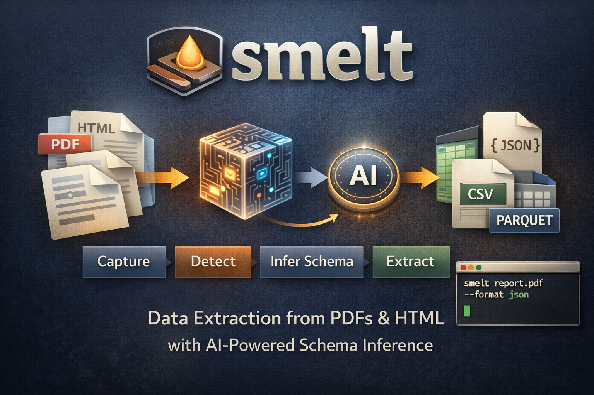

# smelt

Extract structured data from PDFs, HTML files, and URLs into JSON or CSV.

smelt captures tables from any document, uses the Anthropic API to infer a typed schema, and outputs clean structured data. The LLM only names and types the columns — all extraction and coercion is deterministic Go.

---

## Install

```bash
go install github.com/akdavidsson/smelt@latest
```

Or build from source:

```bash
git clone https://github.com/akdavidsson/smelt
cd smelt
go build -o smelt .
```

---

## Quickstart

```bash
export ANTHROPIC_API_KEY=sk-ant-...

smelt https://en.wikipedia.org/wiki/List_of_countries_by_GDP_\(PPP\)_per_capita
```

---

## Usage

```
smelt [input] [flags]
```

`input` can be a local file path, an HTTP/HTTPS URL, or omitted to read from stdin.

### Examples

```bash
# Extract from a URL (auto-selects the largest table)
smelt https://en.wikipedia.org/wiki/List_of_countries_by_GDP_\(PPP\)_per_capita

# Output as CSV
smelt report.html --format csv

# Save to a file
smelt annual_report.pdf --format csv --output data.csv

# Use a query hint to guide table selection and schema naming
smelt https://example.com/financials.html --query "revenue by region"

# Inspect all tables without an API key, then pick one
smelt report.html --raw
smelt report.html --table 2

# Extract every table as a JSON array
smelt https://en.wikipedia.org/wiki/List_of_S%26P_500_companies --all

# Print only the inferred schema
smelt data.html --schema

# Read from stdin
curl -s https://example.com/data.html | smelt --format csv

# Use a specific model
smelt data.html --model claude-opus-4-6
```

---

## Flags

| Flag | Short | Default | Description |
|---|---|---|---|
| `--format` | `-f` | `json` | Output format: `json`, `csv`, `parquet` |
| `--output` | `-o` | | Write output to file instead of stdout |
| `--query` | `-q` | | Natural language hint for schema inference and table selection |
| `--table` | | `0` (auto) | Select Nth table by index (1-based); see `--raw` for indices |
| `--all` | | | Extract all tables; outputs a JSON array of `{name, context, records}` |
| `--schema` | | | Print the inferred schema as JSON and exit |
| `--raw` | | | Print extracted regions to stderr and exit (no API key required) |
| `--model` | | `claude-sonnet-4-6` | Anthropic model to use (overrides config) |
| `--verbose` | `-v` | | Enable verbose logging to stderr |
| `--ocr` | | | Enable OCR (not yet implemented) |

---

## How it works

```
Input (file / URL / stdin)
        |
        v
Capture: parse all tables --> []Region        (pure Go: goquery for HTML, pdfcpu for PDF)
        |
        v
Select region: --table N  |  --all  |  auto (largest + query-matched)
        |
        v
Infer schema via Anthropic API                (single API call, JSON output)
        |
        v
Extract records against schema                (pure Go, soft type coercion)
        |
        v
Write JSON / CSV to stdout or file
```

Only one API call is made per run (or one per table with `--all`). The LLM receives a text sample of the table and returns a JSON schema with column names, types, and nullability. It never sees the full document.

### Inferred schema example

```json
{
  "name": "gdp_ppp_per_capita",
  "description": "Countries ranked by GDP (PPP) per capita",
  "columns": [
    {"name": "rank",            "type": "int",    "nullable": false},
    {"name": "country",         "type": "string", "nullable": false},
    {"name": "gdp_per_capita",  "type": "int",    "nullable": true}
  ]
}
```

Supported column types: `string`, `int`, `float`, `bool`, `date`, `datetime`.

### Multiple tables

Use `--raw` to list all tables found in a document without making an API call:

```
$ smelt report.html --raw

--- Region 1 (Summary): table: 3 cols x 5 rows ---
...

--- Region 2 (Revenue by Quarter): table: 4 cols x 12 rows ---
...
```

Then extract a specific one:

```bash
smelt report.html --table 2
```

Or extract all at once:

```bash
smelt report.html --all
```

`--all` outputs a JSON array:

```json
[
  {
    "name": "summary",
    "context": "Summary",
    "records": [...]
  },
  {
    "name": "revenue_by_quarter",
    "context": "Revenue by Quarter",
    "records": [...]
  }
]
```

### Query-guided selection

The `--query` flag does two things:

1. Boosts the score of tables whose heading matches your query terms, so `--query "revenue"` prefers a table titled "Revenue by Region" over a navigation table.
2. Passes the hint to the LLM for more accurate schema naming.

```bash
smelt https://example.com/report.html --query "annual revenue by product line"
```

---

## Configuration

smelt reads configuration from the environment and an optional config file.

**Environment variable:**

```bash
export ANTHROPIC_API_KEY=sk-ant-...
```

**Config file** (`~/.smelt/config.yaml`):

```yaml
api_key: sk-ant-...
model: claude-opus-4-6
```

Environment variables take precedence over the config file. The `--model` flag takes precedence over both.

---

## Output

- **stdout** — structured data only (JSON or CSV)
- **stderr** — warnings, verbose logs, and `--raw` region dumps

This makes smelt pipeline-friendly:

```bash
smelt https://example.com/data.html --format csv | csvkit | ...
smelt report.pdf | jq '.[] | select(.value > 1000)'
```

Type coercion is soft: if a value cannot be parsed to the inferred type, smelt emits a warning on stderr and falls back to the raw string (or `null` for nullable columns), rather than aborting.

---

## Requirements

- Go 1.24+
- `ANTHROPIC_API_KEY` (not required for `--raw`)
